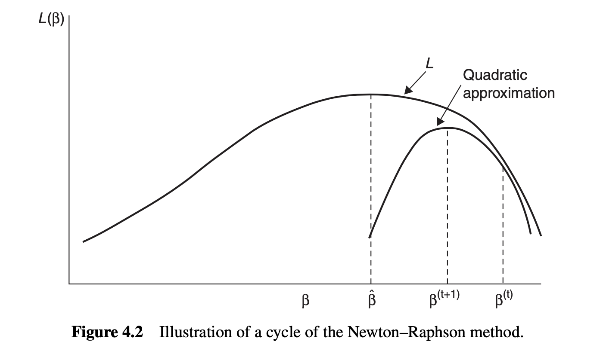

## [Homepage](../index.html)

```{r}
#| warning: false
#| echo: false
#| include: false
#| message: false
#| purl: false

knitr::purl("un_E.qmd", output = "../code/un_E.R", documentation = 0)
styler:::style_file("../code/un_E.R")

library(ggplot2)
library(ggthemes)
library(MLGdata)
```

::: columns
::: {.column width="30%"}
{width="100%"}

[John A. Nelder](https://en.wikipedia.org/wiki/John_Nelder) and [Robert Wedderburn](https://en.wikipedia.org/wiki/Robert_Wedderburn_(statistician))

Imperial College, London
:::

::: {.column width="70%"}

- In [Unit D](un_D.html), we encountered [overdispersion]{.orange} as a key failure mode of Poisson (and binomial) regression.

- This unit introduces [quasi-likelihoods]{.blue}, a flexible framework for handling overdispersion without fully specifying a parametric distribution.

- We only need to specify a [mean-variance relationship]{.orange}, not the full distribution.

- [Wedderburn (1974)]{.grey} introduced quasi-likelihoods, extending the GLM framework of @Nelder1972.
:::

:::

:::callout-tip
The content of this Unit is covered in [Chapter 5]{.orange} of @Salvan2020. Alternatively, see [Chapter 4]{.blue} of @Agresti2015 and the original paper @Wedderburn1974.
:::

# Overdispersion

## Overdispersion: recap

- Recall that for a GLM from the [exponential dispersion family]{.blue}, the variance of $Y_i$ satisfies
$$
\text{var}(Y_i) = \phi \, V(\mu_i),
$$
where $V(\mu_i)$ is the [variance function]{.orange} and $\phi$ is the [dispersion parameter]{.blue}.

- For [Poisson regression]{.orange}, $\phi = 1$ is fixed and $V(\mu) = \mu$, so $\text{var}(Y_i) = \mu_i$.

- For [binomial regression]{.orange}, $\phi = 1$ is fixed and $V(\mu) = \mu(1 - \mu)/m_i$.

- [Overdispersion]{.blue} occurs when the observed variance [exceeds]{.orange} what the model predicts, i.e., when the true $\phi > 1$.

- Ignoring overdispersion leads to [underestimated standard errors]{.orange}, artificially narrow confidence intervals, and inflated test statistics.

## Detecting overdispersion

- A simple diagnostic is the [Pearson statistic]{.blue}
$$
X^2 = \sum_{i=1}^n \frac{(y_i - \hat\mu_i)^2}{V(\hat\mu_i)},
$$
where $\hat\mu_i$ is the estimated mean under the fitted GLM.

- Under the correct model, $X^2 \approx \phi(n - p)$, so the ratio
$$
\hat\phi = \frac{X^2}{n - p}
$$
estimates $\phi$. If $\hat\phi \gg 1$, [overdispersion is present]{.orange}.

- Equivalently, one can examine the [residual deviance]{.blue}: if $D / (n - p) \gg 1$, the model is overdispersed.

- Overdispersion can arise from [unobserved heterogeneity]{.blue}, [clustering]{.orange}, or a [misspecified mean structure]{.grey}.

## Two remedies for overdispersion

The two most common approaches to handle overdispersion are:

1. [Quasi-likelihoods]{.blue} (Wedderburn, 1974): relax the distributional assumption by specifying only the [mean-variance relationship]{.orange}. The dispersion parameter $\phi$ is treated as a free parameter to be estimated.

2. [Parametric overdispersed models]{.orange}: replace the Poisson with a [negative-binomial]{.blue} distribution, or the binomial with a [beta-binomial]{.grey}.

- The quasi-likelihood approach is simpler and more flexible, as it does not require specifying a full distribution.

- The parametric approach allows [likelihood-based inference]{.blue} (AIC, likelihood ratio tests) but requires a stronger modeling assumption.

# Quasi-likelihoods

## The quasi-likelihood function

- @Wedderburn1974 proposed extending GLMs by working with a [quasi-likelihood]{.blue} function defined by its [score]{.orange} rather than by a density.

- Suppose we specify only that $\mathbb{E}(Y_i) = \mu_i$ and $\text{var}(Y_i) = \phi \, V(\mu_i)$, where $V(\cdot)$ is a given [variance function]{.blue}.

- The [quasi-score]{.orange} for a single observation $y_i$ is defined as
$$
U_i(\mu_i) = \frac{y_i - \mu_i}{\phi \, V(\mu_i)},
$$
which mimics the score of an exponential dispersion family.

- The [quasi-likelihood]{.blue} for a single observation is then obtained by integration:
$$
Q(\mu_i; y_i) = \int_{y_i}^{\mu_i} \frac{y_i - t}{\phi \, V(t)} \, dt.
$$
Note that $Q$ depends on $y_i$ and $\mu_i$, but [not on a specific distribution]{.orange}.

## Properties of the quasi-score

- The quasi-score satisfies properties analogous to those of a genuine score function. Specifically, it satisfies:

$$
\mathbb{E}\left[U_i(\mu_i)\right] = 0, \qquad \text{var}\left[U_i(\mu_i)\right] = \frac{1}{\phi \, V(\mu_i)}.
$$

:::callout-tip
These two properties are the [only]{.blue} requirements for $U_i$ to behave like a score. No full distributional assumption is needed.
:::

- The [total quasi-score]{.blue} is
$$
U(\beta) = \sum_{i=1}^n U_i(\mu_i) \cdot \frac{\partial \mu_i}{\partial \beta} = \frac{1}{\phi}\sum_{i=1}^n \frac{(y_i - \mu_i)}{V(\mu_i)} \cdot \frac{1}{g'(\mu_i)}\bm{x}_i,
$$
where $g$ is the link function.

- Setting $U(\beta) = 0$ gives the [quasi-likelihood equations]{.orange}, which are identical to the likelihood equations of a GLM with variance function $V(\mu)$.

## Quasi-maximum likelihood estimation

- The [quasi-maximum likelihood estimator]{.blue} (QMLE) $\hat\beta$ solves $U(\beta) = 0$, i.e.,
$$
\sum_{i=1}^n \frac{(y_i - \hat\mu_i)}{V(\hat\mu_i) \, g'(\hat\mu_i)}\bm{x}_i = 0.
$$

- These are exactly the [IWLS equations]{.orange} of a GLM with variance function $V(\mu)$. Therefore, the QMLE can be computed with the same [iteratively reweighted least squares]{.blue} algorithm:
$$
\hat\beta^{(k+1)} = \left(\bm{X}^T \hat{\bm{W}}^{(k)} \bm{X}\right)^{-1} \bm{X}^T \hat{\bm{W}}^{(k)} \bm{z}^{(k)},
$$
where $\hat{W}_{ii}^{(k)} = \{V(\hat\mu_i^{(k)}) \, [g'(\hat\mu_i^{(k)})]^2\}^{-1}$ and $z_i^{(k)} = \hat\eta_i^{(k)} + (y_i - \hat\mu_i^{(k)})g'(\hat\mu_i^{(k)})$.

:::callout-tip
In practice, fitting a quasi-likelihood model in **R** is as simple as changing the `family` argument in `glm()`. The point estimates $\hat\beta$ are [identical]{.orange} to those of the corresponding GLM; only the standard errors change.
:::

## Asymptotic properties of the QMLE

- Under mild regularity conditions, $\hat\beta$ is [consistent]{.blue} and [asymptotically normal]{.orange}:
$$
\hat\beta \overset{a}{\sim} \mathrm{N}\!\left(\beta,\, \phi\left(\bm{X}^T \bm{W} \bm{X}\right)^{-1}\right),
$$
where $\bm{W} = \mathrm{diag}\!\left\{[V(\mu_i)\,g'(\mu_i)^2]^{-1}\right\}$.

- Compared to the GLM with $\phi = 1$, the variance is [inflated by $\phi$]{.orange}. Therefore, the standard errors of $\hat\beta_j$ are:
$$
\widehat{\mathrm{se}}(\hat\beta_j) = \sqrt{\hat\phi\,\left[\left(\bm{X}^T \hat{\bm{W}} \bm{X}\right)^{-1}\right]_{jj}}.
$$

- The inflation factor $\sqrt{\hat\phi}$ reflects the additional uncertainty due to overdispersion.

- Consistency holds even if the [variance function is misspecified]{.blue}, as long as the mean model $\mathbb{E}(Y_i) = \mu_i = g^{-1}(\bm{x}_i^T\beta)$ is correct. 📖

# Estimation of the dispersion

## Estimation of $\phi$

- Since $\phi$ is unknown, it must be estimated from the data. The standard estimator is the [Pearson estimator]{.blue}:
$$
\hat\phi_P = \frac{X^2}{n - p} = \frac{1}{n - p}\sum_{i=1}^n \frac{(y_i - \hat\mu_i)^2}{V(\hat\mu_i)},
$$
where $p$ is the number of estimated regression coefficients.

- An alternative estimator is based on the [deviance]{.orange}:
$$
\hat\phi_D = \frac{D(\hat\mu; y)}{n - p}.
$$

- In large samples, both estimators are consistent under the quasi-likelihood model.

- The [Pearson estimator]{.blue} $\hat\phi_P$ is generally preferred in practice and is used by default in **R**.

:::callout-warning
The divisor $n - p$ reflects the [degrees of freedom]{.orange}: we lose one degree of freedom for each estimated parameter. This is analogous to dividing by $n - p$ when estimating $\sigma^2$ in linear regression.
:::

# Specific models

## Quasi-Poisson

- In [quasi-Poisson regression]{.blue}, we retain the Poisson mean model $\mu_i = \exp(\bm{x}_i^T\beta)$ and the variance function $V(\mu) = \mu$, but allow $\phi \ne 1$:
$$
\mathbb{E}(Y_i) = \mu_i, \qquad \text{var}(Y_i) = \phi \, \mu_i.
$$

- The QMLE $\hat\beta$ coincides with the Poisson MLE. Only the standard errors differ:
$$
\widehat{\mathrm{se}}_{\text{quasi}}(\hat\beta_j) = \sqrt{\hat\phi_P} \cdot \widehat{\mathrm{se}}_{\text{Poisson}}(\hat\beta_j).
$$

- In **R**, fit with `family = quasipoisson` (or equivalently `family = quasi(link = "log", variance = "mu")`):

```{r}
#| echo: true
library(MLGdata)
data(Ants)
Ants$Bread <- as.factor(Ants$Bread)
Ants$Filling <- as.factor(Ants$Filling)
Ants$Butter <- as.factor(Ants$Butter)

m_pois <- glm(Ant_count ~ Bread + Filling + Butter,
  family = poisson, data = Ants
)
m_qpois <- glm(Ant_count ~ Bread + Filling + Butter,
  family = quasipoisson, data = Ants
)
```

## Quasi-Poisson: dispersion and standard errors

```{r}
#| echo: true
# Estimated dispersion parameter
phi_hat <- summary(m_qpois)$dispersion
phi_hat

# Ratio of standard errors: quasi vs Poisson
se_ratio <- summary(m_qpois)$coefficients[, 2] /
  summary(m_pois)$coefficients[, 2]
round(se_ratio, 4)
```

- All standard errors are inflated by the same factor $\sqrt{\hat\phi_P}$.

- The [point estimates]{.orange} $\hat\beta$ are identical in both models.

## Quasi-binomial

- In [quasi-binomial regression]{.blue}, the mean model remains $\mu_i = g^{-1}(\bm{x}_i^T\beta)$ with variance function $V(\mu) = \mu(1 - \mu)/m_i$, but $\phi$ is free:
$$
\mathbb{E}(Y_i) = \pi_i, \qquad \text{var}(Y_i) = \phi \, \frac{\pi_i(1 - \pi_i)}{m_i}.
$$

- As before, the QMLE coincides with the binomial MLE; only the standard errors are rescaled.

- In **R**, fit with `family = quasibinomial`.

- The quasi-binomial is commonly used when the [effective sample size]{.orange} within each binomial group is smaller than $m_i$ (e.g., due to clustering), leading to extra-binomial variation.

:::callout-tip
More general variance functions are possible. For instance, `family = quasi(link = "log", variance = "mu^2")` specifies $V(\mu) = \mu^2$, corresponding to a [constant coefficient of variation]{.blue}, which is appropriate for Gamma-like data.
:::

# Inference

## Hypothesis testing

- For testing $H_0: \beta_j = 0$, use the [quasi-$t$ statistic]{.blue}:
$$
T_j = \frac{\hat\beta_j}{\widehat{\mathrm{se}}(\hat\beta_j)} \overset{a}{\sim} t(n - p).
$$

- For testing a set of $q$ linear restrictions $H_0: C\beta = 0$, use the [quasi-$F$ statistic]{.blue}:
$$
F = \frac{(D_0 - D_1)/q}{\hat\phi} \overset{a}{\sim} F(q,\, n - p),
$$
where $D_0$ and $D_1$ are the deviances of the restricted and unrestricted models.

- The $F$-test [replaces]{.orange} the likelihood ratio test (chi-squared) used in standard GLMs, because quasi-likelihoods do not yield a proper likelihood ratio statistic.

```{r}
#| echo: true
m_reduced <- glm(Ant_count ~ Bread + Filling,
  family = quasipoisson, data = Ants
)
anova(m_reduced, m_qpois, test = "F")
```

## Model selection: quasi-AIC

- The standard [AIC]{.orange} requires a proper log-likelihood, which is not available under quasi-likelihood.

- A natural analog is the [quasi-AIC (QAIC)]{.blue}, proposed by @McCullagh1989:
$$
\text{QAIC} = \frac{-2 Q(\hat\mu; y)}{\hat\phi} + 2p,
$$
where $Q(\hat\mu; y) = \sum_i Q(\hat\mu_i; y_i)$ is the total quasi-log-likelihood evaluated at $\hat\mu$.

- Equivalently, since the quasi-score equations are identical to the GLM score equations, one can compute the AIC from the [Poisson/binomial log-likelihood]{.orange} and then divide by $\hat\phi$:
$$
\text{QAIC} \approx \frac{\text{AIC}_\text{Poisson}}{\hat\phi} + 2p\left(1 - \frac{1}{\hat\phi}\right).
$$

:::callout-warning
The QAIC [cannot]{.orange} be compared across models fitted with different estimated $\hat\phi$. Compare models using the same $\hat\phi$, estimated from the most complex model considered.
:::

## Model selection in R

- In **R**, `AIC()` and `BIC()` return `NA` for quasi-likelihood models. Use `anova(..., test = "F")` for comparing nested models.

```{r}
#| echo: true
# F-test for nested models (quasi-likelihood)
anova(m_reduced, m_qpois, test = "F")
```

- For [non-nested models]{.orange} or model selection across many candidates, one approach is to fit the Poisson model, obtain $\hat\phi$ from the full model, and then compute QAIC manually.

# A complete example

## The `Ants` dataset

- The `Ants` dataset (from the `MLGdata` library) records the [number of ants]{.blue} ($Y_i$) attracted to different types of sandwiches in an experiment.

- The [explanatory variables]{.orange} are categorical: type of `Bread` (2 levels), `Filling` (3 levels), and `Butter` (2 levels).

- We fit a [Poisson]{.blue} and a [quasi-Poisson]{.orange} model and compare inference.

```{r}
#| echo: true
head(Ants[, 1:4], 6)
```

## Fitting and comparing models

```{r}
#| echo: true
summary(m_qpois)$coefficients
```

- The estimated dispersion is $\hat\phi_P \approx$ `r round(phi_hat, 2)`, indicating [moderate overdispersion]{.orange}.

- Standard errors under the quasi-Poisson are larger by a factor of $\sqrt{\hat\phi_P} \approx$ `r round(sqrt(phi_hat), 2)`.

## Confidence intervals

```{r}
#| echo: true
# 95% confidence intervals: Poisson vs quasi-Poisson
ci_pois <- confint.default(m_pois)
ci_qpois <- confint.default(m_qpois)

# Width ratio (quasi-Poisson / Poisson)
round(
  (ci_qpois[, 2] - ci_qpois[, 1]) / (ci_pois[, 2] - ci_pois[, 1]),
  3
)
```

- All confidence intervals under the quasi-Poisson are wider by the factor $\sqrt{\hat\phi_P}$.

- The [point estimates]{.blue} are unchanged, but the [inferential conclusions]{.orange} may differ: some terms that appear significant under Poisson may no longer be significant after correcting for overdispersion.

## Prediction intervals

- Under quasi-Poisson, a [prediction interval]{.blue} for a new observation $Y_\text{new}$ with covariate $\bm{x}_\text{new}$ is based on the approximation
$$
Y_\text{new} \overset{a}{\sim} \mathrm{N}(\hat\mu_\text{new},\, \hat\phi \, \hat\mu_\text{new}).
$$

```{r}
#| echo: true
# Prediction for a specific sandwich
newdata <- data.frame(Bread = "2", Filling = "3", Butter = "1")
pred <- predict(m_qpois, newdata = newdata, type = "link", se.fit = TRUE)

alpha <- 0.05
z <- qnorm(1 - alpha / 2)
mu_hat <- exp(pred$fit)

# Confidence interval for the mean
ci_mean <- exp(c(pred$fit - z * pred$se.fit, pred$fit + z * pred$se.fit))

# Approximate prediction interval for Y_new
ci_pred <- qnorm(
  c(alpha / 2, 1 - alpha / 2),
  mean = mu_hat,
  sd = sqrt(phi_hat * mu_hat)
)

round(rbind(ci_mean, ci_pred), 2)
```

# Summary

## Summary

- [Quasi-likelihoods]{.blue} extend GLMs by requiring only the specification of a [mean-variance relationship]{.orange} $\text{var}(Y_i) = \phi \, V(\mu_i)$, without assuming a full parametric distribution.

- The [QMLE]{.blue} is computed via [IWLS]{.orange}, yielding the [same point estimates]{.grey} as the corresponding GLM. Only the standard errors are affected.

- The [dispersion parameter]{.orange} $\phi$ is estimated by $\hat\phi_P = X^2/(n-p)$ and inflates all standard errors by $\sqrt{\hat\phi_P}$.

- Inference is based on [quasi-$t$]{.blue} and [quasi-$F$]{.orange} statistics instead of $z$ and chi-squared statistics.

- [Model selection]{.blue} uses $F$-tests for nested models; QAIC is available but requires care.

- The most commonly used quasi-likelihood models are [quasi-Poisson]{.blue} and [quasi-binomial]{.orange}.

## References
